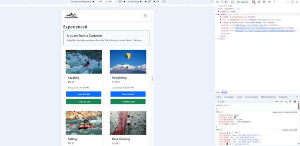
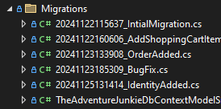
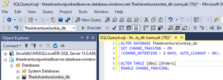
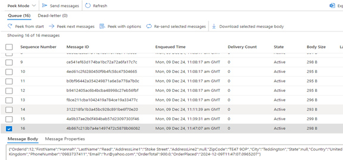
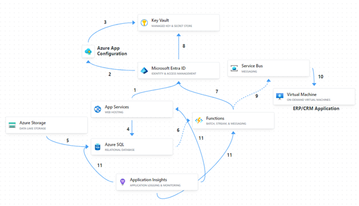
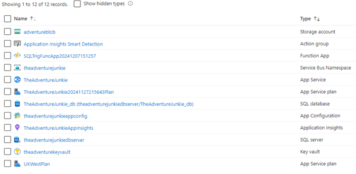

<h1 align="center">The Adventure Junkie</h1>

## 1.	Introduction
I have implemented a web application, based upon the “The Adventure Junkie” app that I had developed in Android, translating it to a web application with extended functionalities. It is basically a mock ecommerce application for adventure sports appointment booking.

## 2.	Technologies Used
•	Web Application:  
🔹ASP.NET Core MVC application  
🔹	Bootstrap  
🔹	Razor Class Libraries (Azure.Identity)  
🔹	Entity Framework Core to work with the database  
 
•	Infrastructure:  
🔹	Azure App Services (F1 Plan)  
🔹	Azure App Configuration (holds Key Vault references)  
🔹	Azure Key Vault (RBAC Policies)  
🔹	Application Insights (Auto Instrumented)  
🔹	Azure Functions (SQL Trigger with Service Bus Queue Output Binding, Consumption Plan)  
🔹	Azure Service Bus Queues  
🔹	Azure Storage Account (For Functions as well as Image URIs)  
🔹	Azure Active Directory (Managed Identities)  
 
•	Database:  
🔹	Azure SQL Database (Managed Instance)  
🔹	SQL server 2019 (Initial Local Development)  
🔹	Microsoft SQL Server Management Studio (Enable change tracking in SQL database)  

## 3.	Code
The code primarily consists of various aspect of typical ASP.NET Core MVC elements of Razor views, partial views, tag helpers, middleware configuration, components, dependency injection, Shared UI folders, ViewModels and routing. Sessions is enabled to use the shopping cart logic, and some other logics are reused. Azure.Identity, Razor class library is used to create the Login UI and logic.
The UI is developed in a responsive mobile-first manner using Bootstrap classes, further Bootstrap components are used like cards, quotes and carousel to improve UX.  
 

 
 
The Entity framework is used in this project. Any database operation was updated into the database using migrations and the database is queried using LINQ. A database initializer is created, to seed the data with some basic data, in case it is empty. 
 

 
 
Azure Function : The function is triggered when a new row is inserted in the “Orders” table; by enabling change tracking on the database and table level via SSMS: 
 

 
 
 This corresponds to a new order being submitted and created in the web application. After being triggered, it serializes the changes into a JSON format and adds it as a message to the service bus queue where it can be consumed by any ERP/CRM application depending on the business need. 
  
 
  
 

## 4.	Infrastructure Implementation
The overall architecture is provided below to get a brief overview of the Implementation: 
 

 
 
1)	The app is hosted in Azure App service which uses managed identities to validate authentication and authorization to retrieve the connection strings for the hosted SQL database.
2)	After authentication, it accesses the app configuration setting, which holds the key vault reference for the secret.
3)	Key Vault secret is accessed, as appropriate RBAC role is assigned to the managed identity of the app.
4)	The connection string is used to access the SQL database and the retrieve the appropriate data.
5)	If the requested data consists of image URIs, it is retrieved from the blob container of the azure storage account.
6)	Whenever an order is created, an azure function is triggered upon row insertion.
7)	Like the web application, the azure function also uses managed identities.
8)	Using which, it can retrieve the SAS key, stored in the Key Vault, to send messages to Azure Service bus Queue, 
9)	The changes are serialized into a JSON format and pushed into the queue.
10)	The pushed message can be consumed by any CRM/ERP application to do inventory management.
11)	The whole process is monitored using application insights which is auto instrumented. 
 
<h1 align="center">Thank You</h1>
 
